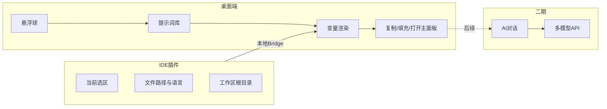
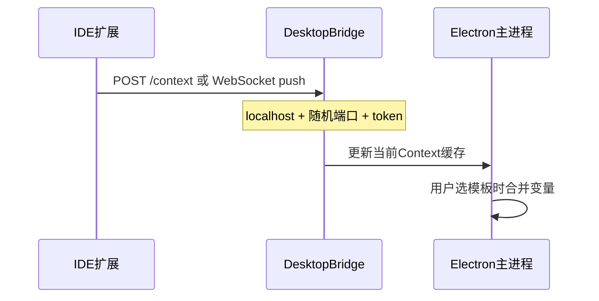

# 编程助手（coding-helper）需求澄清与实施规划

## 已确认的产品边界


| 维度  | 你的选择                  | 对设计的影响                                    |
| --- | --------------------- | ----------------------------------------- |
| AI  | 用户自备 API Key          | 密钥本地加密存储；多 Provider 适配层；无厂商锁定             |
| 上下文 | VS Code / Cursor 插件推送 | 桌面端需常驻本地 Bridge（HTTP/WebSocket）；提示词支持变量占位 |
| MVP | 悬浮球 + 提示词库 + 一键复制/填充  | 第一版可不做完整 Chat UI；但架构需为二期 AI 留接口           |
| 平台  | Windows + macOS       | 选用 Electron + electron-builder 双平台打包      |


工作区 `[coding-helper](d:\GitCode\MyTools\coding-helper)` 目前为空；可参考同仓库 `[easy_clock](d:\GitCode\MyTools\easy_clock)` 的透明置顶无边框窗口实现，以及 `[MiniOpenClaw](d:\GitCode\MyTools\MiniOpenClaw)` 的多模型与可扩展内容加载思路。

---

## 1. 产品定位与目标用户

**一句话**：开发者在 IDE 旁随时唤起的「阶段化提示词 + 上下文注入」工具，减少重复写 Prompt、统一团队评审/拆解话术，并为后续 AI 对话打底。

**目标用户**：日常写业务代码的软件开发者（个人或小团队），已在 Cursor/VS Code 中工作。

**核心价值（按优先级）**：

1. 按研发阶段快速拿到高质量 Prompt 模板（可复制或带上下文发送）
2. 从 IDE 自动带入当前文件、语言、选区，避免手动粘贴
3. （二期）在同一应用内完成需求拆解、技术选型、需求/代码评审对话

**明确不做（MVP）**：

- 替代 IDE 或 Cursor 的主编辑体验
- 云端账号体系、团队权限（可列为远期）
- 自动改代码、无确认的文件写入（安全红线）

---

## 2. 用户场景与功能地图




### 2.1 研发全阶段提示词库（MVP 核心）

建议内置 **7 个一级分类**，每类 5–10 条可维护模板（JSON/YAML + Markdown 正文）：


| 阶段          | 典型用途         | 示例模板名                    |
| ----------- | ------------ | ------------------------ |
| 需求澄清        | 模糊需求 → 可开发条目 | 用户故事拆解、验收标准生成、边界与异常场景追问  |
| 技术选型        | 方案对比与决策记录    | 多方案对比表、非功能需求约束、技术债评估     |
| 设计评审        | PRD/接口/表结构   | 需求一致性检查、API 契约评审、安全与权限清单 |
| 编码实现        | 具体实现辅助       | 模块骨架、错误处理策略、日志与可观测性      |
| Code Review | 提交前/后审查      | 变更影响面、命名与可读性、性能与并发风险     |
| 测试与发布       | 质量与上线        | 测试用例补全、回归范围、发布检查清单       |
| 排障与重构       | 线上/遗留代码      | 根因分析五步、最小改动重构计划          |


**模板能力要求**：

- 支持占位变量：`{{selection}}`、`{{filePath}}`、`{{language}}`、`{{workspaceName}}`、`{{branch}}`（branch 可三期接 git）
- 支持「片段」：用户选中模板后预览渲染结果，再执行动作
- 用户可增删改、导入/导出个人库；内置库只读或可 fork 为自定义

**MVP 动作（你选的「一键复制/填充」）**：

1. **复制到剪贴板** — 渲染后的完整 Prompt，粘贴到 Cursor Chat
2. **填充主面板输入框** — 打开主窗口并写入输入区（为二期「发送给 LLM」预留）
3. **（可选）发送到 IDE** — 扩展命令把文本插入终端注释或新建 scratch 文件（实现成本低、兼容性好）

### 2.2 悬浮球（MVP）

行为参考 `[easy_clock/main.js](d:\GitCode\MyTools\easy_clock\main.js)`：`transparent`、`frame: false`、`alwaysOnTop`、`skipTaskbar`、可拖拽。


| 交互  | 说明                       |
| --- | ------------------------ |
| 单击  | 展开径向/列表快捷菜单：最近使用、按阶段分类入口 |
| 双击  | 打开/收起主面板（提示词库 + 预览）      |
| 右键  | 置顶开关、透明度、开机自启、退出         |
| 拖拽  | 记忆屏幕坐标（多显示器需存 displayId） |


**设置项**：显示/隐藏悬浮球、热键唤出（如 `Ctrl+Shift+H`）、贴边吸附、主题浅色/深色。

### 2.3 IDE 插件（MVP 与桌面端协同）

**目标编辑器**：VS Code API 兼容 → 同时覆盖 **VS Code** 与 **Cursor**。

**通信模型**：




**扩展提供的能力**：

- 命令：`Coding Helper: Push Context`（推送 filePath、languageId、selection、workspaceFolders）
- 可选：选区变化时 debounce 自动推送（设置开关，默认关）
- 状态栏显示连接状态（已连接 / 桌面端未启动）

**安全**：仅监听 `127.0.0.1`；首次配对显示一次性 token；拒绝无 token 请求。

### 2.4 AI 对话与评审（二期，架构预埋）

虽 MVP 不做完整 Chat，但应在主进程预留：

- `ProviderAdapter` 接口（OpenAI 兼容格式覆盖 DeepSeek、智谱等，可参考 MiniOpenClaw 的 `[packages/agent/src/models](d:\GitCode\MyTools\MiniOpenClaw\packages\agent\src\models)`）
- 流式 SSE/WebSocket 到渲染进程
- 会话本地存储（JSON/SQLite）
- API Key 存入 OS Keychain（`keytar` 或 `safeStorage`）

**二期场景**：在已渲染的 Prompt 上点击「开始对话」→ 带入同一 context → 多轮追问；评审模式可附加「仅输出 checklist / 按严重程度分级」等系统指令。

---

## 3. 信息架构（IA）

```
coding-helper/
├── apps/
│   ├── desktop/          # Electron 主应用
│   └── vscode-extension/ # IDE 桥接
├── packages/
│   ├── shared/           # 类型、Prompt  schema、变量解析
│   └── prompts/          # 内置提示词库（JSON + md body）
└── docs/
    └── REQUIREMENTS.md   # 本文档沉淀
```

**主界面（MVP）三个区域**：

1. 左侧：阶段分类树 + 搜索
2. 中间：模板列表 + 收藏
3. 右侧：预览（渲染后）+ 操作按钮 + 当前 IDE 上下文摘要

---

## 4. 技术选型建议


| 层级       | 推荐                                 | 理由                                                                      |
| -------- | ---------------------------------- | ----------------------------------------------------------------------- |
| 桌面壳      | **Electron 28+**                   | 你已有 `[easy_clock](d:\GitCode\MyTools\easy_clock)` 打包与悬浮窗经验；跨 Win/Mac 成熟 |
| 渲染 UI    | **React + TypeScript + Vite**      | 组件化提示词库 UI；与扩展共享 types                                                  |
| monorepo | **pnpm workspace**                 | 与 MiniOpenClaw 一致，desktop/extension/shared 分包                           |
| 配置持久化    | `electron-store`                   | 窗口位置、最近模板、用户自定义库                                                        |
| IDE 通信   | 本地 HTTP（`express`/`fastify`）或 `ws` | 实现简单、易调试；MVP 够用                                                         |
| 打包       | `electron-builder`                 | 沿用 easy_clock 的 nsis/dmg 配置模式                                           |


**为何不首选 Tauri（本阶段）**：悬浮球 + 双端打包 + 与现有 Electron 资产复用更重要；Tauri 可作为远期体积优化选项。

**Electron 安全基线（区别于 easy_clock 旧写法）**：

- `contextIsolation: true`，`preload` 暴露有限 IPC
- 禁用渲染进程 `nodeIntegration`

---

## 5. 分阶段交付计划

### Phase 1 — MVP（约 2–3 周，可并行）

- Electron 悬浮球 + 主面板骨架
- 内置 7 阶段提示词库（中文为主，schema 定稿）
- 变量解析 + 复制/填充主面板
- 用户自定义模板 CRUD + 导入导出
- VS Code/Cursor 扩展：推送 context + 连接状态
- Win/Mac 本地开发与 electron-builder 产物

**验收标准**：

- 在 Cursor 中选一段代码 → 扩展推送 → 桌面选「Code Review」模板 → 复制内容包含选区与文件路径
- 悬浮球可隐藏、重启后位置与设置保留
- 无 IDE 时仍可使用模板（变量留空或提示「未连接」）

### Phase 2 — AI 能力（约 2 周）

- 设置页：Provider、Model、API Key（Keychain）
- 主面板 Chat：流式输出、会话历史、从模板一键发起
- 模板级 `systemPrompt` 可选字段

### Phase 3 — 增强（按需）

- Git diff / 最近 commit 注入
- 团队共享提示词库（Git 目录或简易 sync）
- 评审报告导出 Markdown
- 全局热键、多语言界面

---

## 6. 非功能需求


| 类别   | 要求                                         |
| ---- | ------------------------------------------ |
| 隐私   | 代码与选区仅 localhost 传输；不上传云端（除非用户主动调 LLM API） |
| 性能   | 空闲内存目标 < 150MB；Bridge 请求 < 50ms            |
| 可靠性  | 桌面端崩溃不影响 IDE；扩展连接失败降级为纯手动模式                |
| 可维护性 | 内置 Prompt 版本号；用户库与内置库分离合并策略                |
| 无障碍  | 主面板支持键盘导航；悬浮球提供替代热键入口                      |


---

## 7. 风险与对策

- **Cursor 是否完全兼容 VS Code 扩展**：基于标准 `vscode` API 开发，避免依赖 Cursor 私有 API；发布说明中标注「在 Cursor 中从 VSIX 安装或开放扩展市场」。
- **macOS 透明窗口**：需在 `BrowserWindow` 上验证 `vibrancy`/`transparent` 差异，单独 QA。
- **MVP 范围膨胀**：严格区分 Phase 1 不做 LLM UI；仅预留 IPC 与 `packages/shared` 中的 `ChatMessage` 类型。
- **提示词质量**：内置库需你方或团队审校一轮；提供「反馈/编辑」闭环而不是一次写死。

---

## 8. 建议的下一步（确认计划后执行）

1. 在 `[coding-helper](d:\GitCode\MyTools\coding-helper)` 初始化 pnpm monorepo 与 `docs/REQUIREMENTS.md`（沉淀本文档）
2. 定义 `PromptTemplate` JSON Schema + 首批 20–30 条内置模板（7 阶段抽样）
3. 实现 `apps/desktop` 悬浮球窗口（复用 easy_clock 窗口参数，升级安全选项）
4. 实现 `apps/vscode-extension` + Desktop Bridge 配对流程
5. Phase 2 再接入 Provider 适配层与 Chat UI

---

## 10. Hi-Fi 原型（UI 评审 / 开发对齐）

**交互式原型（推荐评审入口）**

- 路径：`[canvases/coding-helper-hifi.canvas.tsx](C:\Users\wayne\.cursor\projects\d-GitCode-MyTools-coding-helper\canvases\coding-helper-hifi.canvas.tsx)`
- 在 Cursor 中打开该 Canvas，可切换 7 个画面：设计总览、主面板、悬浮球、快捷菜单、设置、IDE 配对、对话（二期标注）
- 含设计令牌表、Electron 窗口映射、组件 → React 路径对照表

**静态 HTML 原型（实现阶段产出）**

确认开始编码后，在 `coding-helper/prototypes/` 生成可双击打开的 HTML（`tokens.css` + 分屏页面），与 Canvas 画面一一对应，供 Electron 窗口像素级对照。

**主面板布局规格（1120×720）**


| 区域   | 宽度     | 内容                            |
| ---- | ------ | ----------------------------- |
| 标题栏  | 高 36px | Logo + 窗口控制                   |
| 阶段侧栏 | 220px  | 搜索 + 7 阶段导航 + 新建模板            |
| 模板列表 | 280px  | 卡片列表、选中左边框 accent             |
| 预览区  | flex   | 标题/操作、IDE 上下文条、Prompt 预览、底栏统计 |


**悬浮球**：52px 圆形，`CH` 标识；快捷菜单宽 280px，锚定在球上方。

**关键交互状态**：IDE 已连接 / 未连接；模板选中；变量 `{{…}}` 高亮；MVP 主 CTA「复制 Prompt」。

---

## 9. 仍可后续细化的选项（不阻塞开工）

- 主面板 UI 风格：极简工具窗 vs 类 ChatGPT 侧边栏（MVP 建议前者）
- 是否需要在 MVP 增加「一键在 Cursor 打开 Composer」的 URI scheme 调研
- 内置模板是否区分技术栈标签（前端/后端/移动端）

如认可本澄清，确认后即可按 Phase 1 在空仓库脚手架开工。